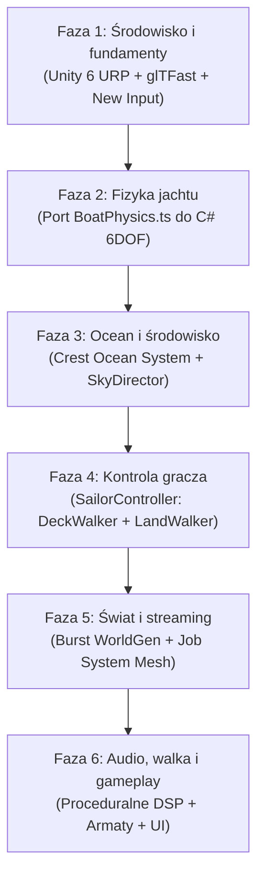

# Architektura migracji: Lagoon (yacht) do Unity

Dokument zawiera zbiór decyzji architektonicznych (**Architecture Decision Records – ADR**) dla technicznej realizacji portu gry Lagoon z Three.js/TypeScript do Unity 6 (URP). Decyzje bazują na dokładnej analizie kodu źródłowego w repozytorium i definiują konkretne rozwiązania programistyczne i graficzne.

---

## Spis decyzji architektonicznych (ADR)

1. [ADR 001: Wybór Render Pipeline i konfiguracja graficzna](#adr-001-wybór-render-pipeline-i-konfiguracja-graficzna)
2. [ADR 002: Implementacja systemu wody, oceanu i optyki podwodnej](#adr-002-implementacja-systemu-wody-oceanu-i-optyki-podwodnej)
3. [ADR 003: Model fizyki żeglowania 6DOF i aerodynamika takielunku](#adr-003-model-fizyki-żeglowania-6dof-i-aerodynamika-takielunku)
4. [ADR 004: Poruszanie się postaci na ruchomym pokładzie i na lądzie](#adr-004-poruszanie-się-postaci-na-ruchomym-pokładzie-i-na-lądzie)
5. [ADR 005: Generowanie świata, streaming kafelków i roślinność](#adr-005-generowanie-świata-streaming-kafelków-i-roślinność)
6. [ADR 006: Atmosfera, chmury wolumetryczne i cykl dobowy](#adr-006-atmosfera-chmury-wolumetryczne-i-cykl-dobowy)
7. [ADR 007: Architektura audio i synteza proceduralna](#adr-007-architektura-audio-i-synteza-proceduralna)
8. [ADR 008: Struktura projektu, Assembly Definitions i pipeline assetów](#adr-008-struktura-projektu-assembly-definitions-i-pipeline-assetów)

---

## ADR 001: Wybór Render Pipeline i konfiguracja graficzna

### Status
Zaakceptowany / Rekomendowany

### Kontekst
W Three.js potok graficzny ([Pipeline.ts](file:///home/mike/Documents/GitHub/yacht/src/render/Pipeline.ts)) realizował renderowanie sceny nieprzezroczystej (opaque), osobny planar reflection pass dla odbić wysp i statku w wodzie, renderowanie siatki wody ze zniekształceniem refrakcyjnym, underwater pass oraz post-processing ([PostProcessor.ts](file:///home/mike/Documents/GitHub/yacht/src/render/PostProcessor.ts): bloom, ACES tone mapping).
Docelowa platforma deweloperska to **Framework Laptop 13 (2025)** ze zintegrowanym układem graficznym (Radeon 780M / 890M lub Intel Arc) i limitem chłodzenia ~28W.

### Rozważane opcje
1. **HDRP (High Definition Render Pipeline):** Zbyt zasobożerny dla zintegrowanych GPU; generowałby wysokie temperatury i niską płynność.
2. **URP (Universal Render Pipeline) Forward+:** Nowoczesny potok w Unity 6, lekki dla pamięci pasma i GPU, obsługujący setki dynamicznych świateł w jednym przebiegu.
3. **URP Deferred:** Większy narzut pamięciowy (G-Buffer), słabsza optymalizacja pod iGPU i problematyczny przy przezroczystościach wody.

### Decyzja
Wybieramy **Unity 6 z Universal Render Pipeline w trybie Forward+**, z natywnym backendem **Vulkan**.

### Szczegóły techniczne i konfiguracja:
- **Render Path:** Forward+
- **Antyaliasing:** Temporal Anti-Aliasing (TAA) lub FidelityFX Super Resolution (FSR) 2/3. Eliminuje to aliasing cienkich lin olinowania statku i odległych fal.
- **Ambient Occlusion:** Screen Space Ambient Occlusion (SSAO) z włączoną opcją *After Opaque*, zapewniające cienie kontaktowe na pokładzie i skałach.
- **Color Grading:** ACES Tone Mapping (odpowiadający dotychczasowemu z Clearwatera) w komponencie URP *Volume*.
- **Planar Reflections:** Implementacja przez lekki `ScriptableRenderPass` renderujący odbicie lustrzane do render targetu w rozdzielczości połowicznej (Half-Res) z maską warstwową wykluczającą drobne detale.

---

## ADR 002: Implementacja systemu wody, oceanu i optyki podwodnej

### Status
Zaakceptowany / Rekomendowany

### Kontekst
Woda w `yacht` to serce projektu:
1. `WaterSpectrum.ts`: GPU FFT 256² na bazie Phillips/JONSWAP.
2. `Ripples.ts`: Równanie falowe 2D w przestrzeni świata (512², 128 m) dla kilwateru, fal dziobowych i piany.
3. `Caustics.ts`: Kaustyki dyspersyjne rzucane na dno i kadłub.
4. `WaterSurface.ts`: Shader z modelem optycznym Clearwater (Fresnel, absorpcja światła, okno Snella od spodu).
5. `UnderwaterPass.ts`: Mgła podwodna, ekstynkcja i promienie świetlne.

### Rozważane opcje
- **Opcja A (Port bezpośredni GLSL → HLSL):** Ręczne przepisanie shaderów Clearwatera na Compute Shadery w Unity.
- **Opcja B (Użycie Crest Ocean System URP):** Otwartoźródłowy, zaawansowany system oceanu dla Unity, posiadający dokładnie te same podsystemy (FFT, dynamic ripples, caustics, planar reflections, underwater post-processing, physics queries).
- **Opcja C (Unity 6 Built-in Water System):** Nowy system wody w Unity 6 URP. Dobre fale, ale trudniejsze rozszerzanie o niestandardowe zachowania podwodne.

### Decyzja
Wybieramy **Crest Ocean System (URP)** jako fundament oceanu, uzupełniony o **customowy shader dna laguny** dla zachowania charakterystycznego wyglądu turkusowej, płytkiej wody z Clearwatera.

### Uzasadnienie i plan integracji:
1. **Dynamiczne wzburzenie i kilwater (Wake/Ripples):** Crest natywnie posiada komponent `RegisterDynWavesInput`, który pozwala rejestrować obiekty zaburzające wodę (kadłub jachtu) bez pisania własnego symulatora równania falowego.
2. **Wielowątkowe zapytania o wysokość fal:** Crest dostarcza interfejs `ICollisionProvider`, który pozwala wątkom C# (Job System) asynchronicznie odpytywać o wysokość wody pod kadłubem statku, co jest kluczowe dla `BoatPhysics`.
3. **Widok podwodny:** Crest automatycznie obsługuje podział kamery na linii wody (waterline split), okno Snella, kaustyki i absorpcję spektralną.
4. **Oszczędność czasu:** Zamiast spędzać 4–6 tygodni na debugowaniu buforów Compute Shaderów pod Vulkanem, otrzymujemy gotowy, zoptymalizowany system klasy AAA.

---

## ADR 003: Model fizyki żeglowania 6DOF i aerodynamika takielunku

### Status
Zaakceptowany / Rekomendowany

### Kontekst
W [BoatPhysics.ts](file:///home/mike/Documents/GitHub/yacht/src/physics/BoatPhysics.ts) zaimplementowano autorski model symulacji jachtu:
- Integracja 6 stopni swobody (6DOF) w kroku czasowym $\Delta t = 1/120\text{ s}$.
- Siła wyporu liczona z 33 kolumn kadłuba zanurzonych w falach Gerstnera.
- Hydrodynamika i aerodynamika: model cienkiego profilu (*thin-foil*) dla stępki, steru i ożaglowania ($C_L, C_D$, kąt natarcia, przeciągnięcie, opór indukowany $k \cdot C_L^2$).
- Wiatr pozorny uwzględniający prędkość statku w środku ożaglowania.
- Opór falowy kadłuba rosnący stromo powyżej liczby Froude'a $\approx 0.4$.
- Proceduralne żagle ([Sails.ts](file:///home/mike/Documents/GitHub/yacht/src/boat/Sails.ts)): deformacja siatki ~2k wierzchołków na CPU pod wpływem wiatru i luzowania szotów.

### Rozważane opcje
1. **Zastąpienie modelu silnikiem PhysX / Unity Rigidbody:** Ryzyko utraty unikalnego, starannie dostrojonego feelingu żeglugi i problematyczne odtworzenie zachowania profili cienkich.
2. **Port 1:1 algorytmu matematycznego do C# (Custom Integrator):** Przeniesienie czystej matematyki wektorowej do klasy C# działającej w `FixedUpdate`.

### Decyzja
Wykonujemy **bezpośredni port 1:1 klasy `BoatPhysics.ts` do C# (`BoatDynamics.cs`)**, traktując kadłub jako obiekt kinematyczny lub własny integrator pozycji/rotacji. Deformacja żagli zostanie zoptymalizowana za pomocą **C# Job System + Burst Compiler**.

### Mapowanie klas i struktur:

| TypeScript (`yacht`) | C# (`Unity`) | Opis |
| :--- | :--- | :--- |
| `interface Foil` | `struct Foil` | Parametry profilu (powierzchnia, $C_{L\max}$, stall, opór) |
| `foilForce(...)` | `FoilMath.CalculateForce(...)` | Czysta funkcja matematyczna `[BurstCompile]` |
| `interface HullPoint` | `struct HullColumn` | Pozycja kolumny kadłuba, pole przekroju, wysokość |
| `BoatPhysics` | `class BoatController : MonoBehaviour` | Integrator fizyki, wejście gracza, sterowanie szotami |
| `Sails.ts` | `SailDeformerJob : IJobParallelFor` | Wielowątkowe wybrzuszanie i łopot żagli |

### Szczegóły deformacji żagli:
W [Sails.ts](file:///home/mike/Documents/GitHub/yacht/src/boat/Sails.ts) wierzchołki były modyfikowane w pętli na CPU w wątku głównym. W Unity:
- Geometria żagla przechowywana w `NativeArray<Vector3>`.
- Zadanie `SailDeformerJob` z atrybutem `[BurstCompile]` oblicza wybrzuszenie w funkcji wiatru pozornego równolegle dla wszystkich żagli.
- Wynik wpisywany bezpośrednio do siatki przez `Mesh.SetVertices(NativeArray)` bez alokacji w pamięci zarządzanej.

---

## ADR 004: Poruszanie się postaci na ruchomym pokładzie i na lądzie

### Status
Zaakceptowany / Rekomendowany

### Kontekst
W projekcie istnieją dwa tryby poruszania się w pierwszej osobie:
1. [DeckWalker.ts](file:///home/mike/Documents/GitHub/yacht/src/camera/DeckWalker.ts): Postać porusza się w układzie współrzędnych jachtu (`boat frame`). Posiada mechanizm kompensacji kołysania (stała `LEVEL = 0.55` – ludzki błędnik niweluje 45% przechyłu, co zapobiega chorobie lokomocyjnej u gracza), kolizje z burtami i nadbudówkami.
2. [LandWalker.ts](file:///home/mike/Documents/GitHub/yacht/src/camera/LandWalker.ts): Poruszanie się po wyspach, omijanie pni drzew, ograniczenie wspinaczki na strome skały (>40°), brodzenie w wodzie przy plaży (`wade`).

### Rozważane opcje
1. **Domyślny `CharacterController` Unity z parentingiem:** Prosty, ale potrafi generować drgania (*jitter*) na szybko obracającym się statku.
2. **Kinematic Character Controller (KCC):** Uznany wzorzec programistyczny dla postaci na obiektach ruchomych.
3. **Dedykowany dwu-trybowy kontroler matematyczny (Port TypeScript):** Zachowanie logiki opartej o bezpośrednie przeliczanie macierzy lokalnej statku i globalnej świata.

### Decyzja
Implementujemy **dedykowany kontroler `SailorController`**, który replikuje podejście z repozytorium:
- Na statku gracz jest transformowany **w przestrzeni lokalnej jachtu** (`transform.parent = boatTransform`). Wszystkie wektory ruchu, grawitacja wewnętrzna i detekcja przeszkód (`DeckMap`) są liczone względem kadłuba.
- Obrót kamery zawiera bufor kompensacji przechyłu:
  $$\text{CamRotation} = \text{Slerp}(\text{BoatRotation}, \text{Identity}, 0.55) \times \text{LookRotation}$$
- Przy zejściu na brzeg lub do szalupy, kontroler przełącza się w tryb globalny (`LandMode`), sprawdzając wysokość terenu z generatora `WorldGen` oraz kolizje ze statycznymi przeszkodami.

---

## ADR 005: Generowanie świata, streaming kafelków i roślinność

### Status
Zaakceptowany / Rekomendowany

### Kontekst
W [WorldGen.ts](file:///home/mike/Documents/GitHub/yacht/src/world/WorldGen.ts) świat jest definiowany deterministycznie i analitycznie:
- Home Lagoon: ręcznie zdefiniowany atol o promieniu 430 m z przejściami w rafie.
- Reszta świata: proceduralne atole, wyspy wulkaniczne, archipelagi oparte o szum FBM i Voronoi.
- [Terrain.ts](file:///home/mike/Documents/GitHub/yacht/src/world/Terrain.ts) i `terrain.worker.ts`: Kafelki 256×256 m dzielone na 4 poziomy szczegółowości (LOD: 128, 64, 32, 16 segmentów). Generowane asynchronicznie w Web Workerach, aby nie blokować wątku renderowania.

### Decyzja
W Unity zastępujemy Web Workery systemem **C# Job System + Burst Compiler**:
1. Algorytmy matematyczne z `WorldGen.ts` (`fbm`, `vnoise`, `islandHeight`) zostają przeniesione do biblioteki struktur `WorldGenMath` skompilowanej przez Burst do instrukcji wektorowych SIMD.
2. **Zadanie `GenerateTerrainMeshJob : IJobParallelFor`**:
   - Generuje pozycje wierzchołków, normalne i współrzędne UV bezpośrednio do `NativeArray<Vector3>` bez udziału GC.
3. **Pula kafelków (Mesh Pooling):** Zamiast ciągłego niszczenia i tworzenia komponentów `Mesh`, używamy puli prealokowanych obiektów siatek.
4. **Roślinność (Vegetation):**
   - Palmy i krzewy umieszczane są zgodnie z regułami z `vegetationPlacement.ts`.
   - Renderowanie przez **GPU Resident Drawer** (nowość w Unity 6 URP) lub `Graphics.RenderMeshInstanced`, co pozwala na wyświetlanie tysięcy palm przy dosłownie 1–2 wywołaniach Draw Call.

---

## ADR 006: Atmosfera, chmury wolumetryczne i cykl dobowy

### Status
Zaakceptowany / Rekomendowany

### Kontekst
W [Clouds.ts](file:///home/mike/Documents/GitHub/yacht/src/environment/Clouds.ts):
- Chmury wolumetryczne modelowane są za pomocą trójwymiarowego szumu Perlin-Worley z ray-marchingiem w układzie współrzędnych hemisfery.
- Obliczane są cienie chmur (*cloud shadow map*) rzucane na ocean i wyspy.
- Cykl dobowy ([GameTime.ts](file:///home/mike/Documents/GitHub/yacht/src/environment/GameTime.ts)) steruje słońcem, fazami księżyca i obrotem gwiazd.
- Pogoda ([Weather.ts](file:///home/mike/Documents/GitHub/yacht/src/environment/Weather.ts)) płynnie interpoluje pomiędzy 6 stanami (od bezchmurnego nieba po sztorm z piorunami).

### Decyzja
1. **Chmury wolumetryczne:**
   - Wykorzystanie natywnego systemu **Volumetric Clouds** dostępnego w Unity 6 URP lub port dotychczasowego shadera `Clouds.ts` jako `ScriptableRenderPass` (Full-Screen Pass). Ze względu na wydajność na zintegrowanej grafice laptopa Framework, ray-marching będzie wykonywany w ćwierć-rozdzielczości (Quarter-Res) z temporalnym upsamplingiem.
2. **Cienie chmur:**
   - Przekazywanie rzutowanej tekstury cieni chmur jako globalnej zmiennej `_CloudShadowTexture` do shaderów terenu i wody.
3. **Cykl nieba i pogody:**
   - Klasy `GameTime.ts` i `Weather.ts` tłumaczymy bezpośrednio na komponenty `SkyDirector.cs` i `WeatherController.cs`, które sterują rotacją i barwą `DirectionalLight` (Słońce/Księżyc), gęstością mgły URP oraz parametrami fal oceanu.

---

## ADR 007: Architektura audio i synteza proceduralna

### Status
Zaakceptowany / Rekomendowany

### Kontekst
Gra posiada unikalny podsystem dźwiękowy ([AudioSystem.ts](file:///home/mike/Documents/GitHub/yacht/src/audio/AudioSystem.ts)):
- Część dźwięków to próbki audio (fale, deszcz, mewy, armaty).
- Kluczowe dźwięki żeglarskie są **generowane proceduralnie w Web Audio API**:
  - Świst wiatru w olinowaniu (biały szum filtrowany pasmowo, częstotliwość modulowana prędkością wiatru pozornego).
  - Szum wody przy burtach kadłuba (generator szumu z filtrem dolnoprzepustowym zależnym od prędkości łodzi).
  - Trzepotanie i łopot żagli (modulowany szum impulsowy przy luźnych szotach).
  - Tłumienie podwodne (filtr dolnoprzepustowy wycinający wysokie tony po zanurzeniu kamery).

### Decyzja
W Unity używamy **Unity Audio z rozszerzeniem DSP w metodzie `OnAudioFilterRead`**:
1. Tworzymy komponent `ProceduralRiggingAudio.cs`, który w metodzie `OnAudioFilterRead(float[] data, int channels)` generuje zoptymalizowany matematycznie szum filtrowany algorytmem biquad (Biquad Filter), wiernie odtwarzając syntezę z Web Audio bez opóźnień.
2. **Dźwięk przestrzenny:** Wszystkie źródła (armaty, mewy, fale przyboju) otrzymują komponenty `AudioSource` z przestrzennym panoramowaniem 3D i krzywą tłumienia logarytmicznego.
3. **Filtr podwodny:** Na obiekcie kamery umieszczamy komponent `AudioLowPassFilter`, który aktywuje się w momencie przejścia obiektywu pod lustro wody (odcięcie na poziomie 350 Hz).

---

## ADR 008: Struktura projektu, Assembly Definitions i pipeline assetów

### Status
Zaakceptowany / Rekomendowany

### Kontekst
Czysta architektura bez monolitycznych zależności ułatwi testowanie modułowe i przyspieszy kompilację skryptów na Framework 13. Modele 3D w repozytorium to zoptymalizowane pliki `.glb` (format glTF 2.0).

### Decyzja

#### 1. Podział na moduły za pomocą Assembly Definitions (`.asmdef`):
- `Lagoon.Core` – Czas, wejście (Input System), konfiguracja, matematyka pomocnicza (`Noise`, `FBM`).
- `Lagoon.Physics` – Integrator 6DOF jachtu, profile cienkie, aerodynamika żagli.
- `Lagoon.Water` – Adapter Crest Ocean System, kaustyki, optyka wody.
- `Lagoon.World` – Generator świata (`WorldGen`), streaming terenu, roślinność.
- `Lagoon.Character` – Kontroler marynarza na pokładzie i na lądzie, kamery.
- `Lagoon.Combat` – Armaty, broń ręczna, balistyka kul armatnich.
- `Lagoon.Audio` – System dźwiękowy i syntezatory proceduralne DSP.

#### 2. Pipeline importu assetów:
- Do importu plików `.glb` wykorzystujemy oficjalny pakiet **UnityGLTF** lub **glTFast**, co pozwala na bezpośrednie używanie obecnych plików zoptymalizowanych narzędziem `gltf-transform` z folderu `public/assets/` bez konieczności ich ręcznej konwersji w Blenderze.
- Uruchamiamy **Unity New Input System** ze zdefiniowanymi mapami akcji: `Sailing` (sterowanie jachtem, szoty), `DeckWalk` (poruszanie się marynarzem), `Combat` (strzelanie, celowanie lunetą).

---

## Plan wdrożenia krok po kroku

1. **Faza 1 (Fundamenty):** Utworzenie projektu Unity 6 URP, import paczek (`glTFast`, `Input System`, `Burst`, `Mathematics`).
2. **Faza 2 (Fizyka łodzi):** Przepisanie [BoatPhysics.ts](file:///home/mike/Documents/GitHub/yacht/src/physics/BoatPhysics.ts) do C#. Uruchomienie pływającego jachtu na prostych falach testowych.
3. **Faza 3 (Ocean):** Integracja Crest Ocean System, spięcie zapytań o wysokość wody z fizyką jachtu.
4. **Faza 4 (Postać):** Przeniesienie `DeckWalker` i `LandWalker` z kompensacją kołysania.
5. **Faza 5 (Świat):** Przeniesienie `WorldGen.ts` do C# Job System, streaming kafelków wokół jachtu.
6. **Faza 6 (Polishing):** Przeniesienie armat, ekwipunku, lunety oraz syntezy audio wiatru.
