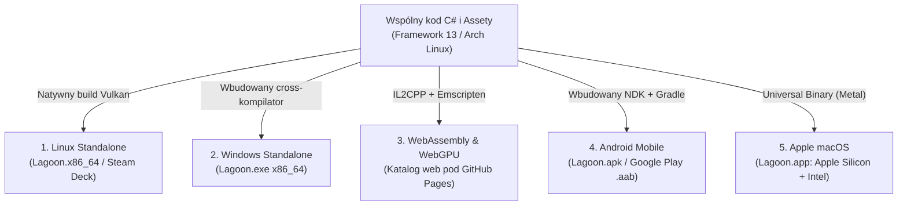

# Możliwości kompilacji skrośnej (Cross-Compilation) z poziomu Arch Linux w Unity 6

Niniejszy dokument opisuje architekturę wieloplatformową Unity 6, pozwalającą na budowanie gotowych wersji gry Lagoon na systemy **Linux, Windows, macOS, przeglądarki WWW (WebAssembly/WebGPU) oraz urządzenia mobilne z Androidem** – wszystko bezpośrednio ze stacji roboczej z systemem **Omarchy Quattro (Arch Linux)**, bez konieczności instalowania maszyn wirtualnych czy emulatorów.

---

## 1. Architektura eksportu wieloplatformowego



---

## 2. Platformy docelowe – konfiguracja i specyfika

### Platforma 1: Linux Standalone (Framework 13, PC, Steam Deck)
- **Moduł w Unity Hub:** `Linux Build Support (IL2CPP / Mono)` (instalowany domyślnie).
- **Backend graficzny:** Natywny **Vulkan 1.3**.
- **Kompatybilność ze Steam Deck:** Ponieważ SteamOS oparty jest na Arch Linux, gra działa w 100% natywnie, w pełni wykorzystując kontrolery i ekran 16:10 Steam Decka bez konieczności stosowania warstwy Proton.
- **Komenda CLI:**
  ```bash
  unity-editor -batchmode -projectPath . -buildLinux64Player ./build/linux/Lagoon.x86_64 -quit -logFile -
  ```

---

### Platforma 2: Windows Standalone (`Lagoon.exe`)
- **Moduł w Unity Hub:** `Windows Build Support (Mono)` lub `Windows Build Support (IL2CPP)`.
- **Wymagania:** **Brak** – nie wymaga instalacji Windowsa, Wine, maszyn wirtualnych ani Visual Studio. Unity posiada wbudowany wewnętrzny cross-kompilator.
- **Format wyjściowy:** Plik wykonywalny `Lagoon.exe` oraz folder danych `Lagoon_Data/` (kompatybilny z Windows 10/11 x86_64).
- **Komenda CLI:**
  ```bash
  unity-editor -batchmode -projectPath . -buildWindows64Player ./build/windows/Lagoon.exe -quit -logFile -
  ```

---

### Platforma 3: WebAssembly i WebGPU (Eksport do przeglądarki WWW)
Pozwala zachować dotychczasową największą zaletę projektu Three.js: **dostępność gry natychmiast pod linkiem bez instalacji**.

- **Moduł w Unity Hub:** `WebGL Build Support`.
- **Jak to działa pod maską:**
  1. Kod C# jest tłumaczony przez **IL2CPP** do C++.
  2. Kompilator **Emscripten** kompiluje kod C++ bezpośrednio do binarnego formatu **WebAssembly (`.wasm`)**.
  3. URP w Unity 6 kompiluje shadery zarówno do WebGL 2.0, jak i do nowoczesnego **WebGPU**, co pozwala na wykorzystanie Compute Shaderów w przeglądarce.
- **Format wyjściowy:** Folder zawierający `index.html`, `Lagoon.wasm`, `Lagoon.data` oraz skrypt ładujący JS.
- **Hosting:** Wrzucasz katalog na **GitHub Pages** (dokładnie tak jak obecnie `dubel.dev/yacht/`), Cloudflare Pages, itch.io lub dowolny darmowy serwer statyczny.
- **Komenda CLI:**
  ```bash
  unity-editor -batchmode -projectPath . -buildTarget WebGL -quit -logFile -
  ```

---

### Platforma 4: Android Mobile (Smartfony i Tablety)
Unity napędza ponad 70% rynku gier mobilnych na świecie, a stylistyka Lagoon w URP jest idealnie dopasowana do procesorów mobilnych.

- **Moduł w Unity Hub:** `Android Build Support` (Unity Hub samoczynnie pobiera dopasowane wersje **Android SDK, NDK oraz OpenJDK** – zero ręcznej konfiguracji).
- **Wymagania systemowe na Arch Linux:**
  ```bash
  sudo pacman -S android-tools
  ```
- **Sterowanie:** Wykorzystanie pakietu *Unity New Input System* z wirtualnym drążkiem sterowym (*On-Screen Stick*) i obrotem kamery dotykiem.
- **Format wyjściowy:**
  - Plik **`.apk`** – do natychmiastowej instalacji na telefonie.
  - Plik **`.aab`** (Android App Bundle) – format wymagany przez Google Play Store.
- **Testowanie przez kabel USB (Build & Run):**
  Po włączeniu w telefonie *Debugowania USB*, Unity po kompilacji automatycznie przesyła grę przez kabel i uruchamia ją na ekranie telefonu w ~20 sekund.

---

### Platforma 5: Apple macOS (`Lagoon.app`)
- **Moduł w Unity Hub:** `Mac Build Support (Mono)` lub `Mac Build Support (IL2CPP)`.
- **Backend graficzny:** Natywne API **Apple Metal**.
- **Format wyjściowy:** Paczka **`Lagoon.app`**. Unity domyślnie generuje tzw. **Universal Binary**, zawierające kod binarny zarówno pod procesory **Apple Silicon (M1/M2/M3/M4 - ARM64)**, jak i komputery Mac z procesorami Intel (x86_64).
- **Haczyk Apple Gatekeeper (Kwarantanna aplikacji):**
  macOS traktuje aplikacje skompilowane poza ekosystemem Apple jako potencjalnie niebezpieczne.
  - *Dla testerów / znajomych:* Wystarczy jedno polecenie w terminalu Maca usuwające atrybut kwarantanny:
    ```bash
    xattr -cr /Sciezka/Do/Lagoon.app
    ```
  - *Dla dystrybucji oficjalnej:* Notaryzacja Apple może być w pełni zautomatyzowana za pomocą darmowego runnera **GitHub Actions** na maszynie wirtualnej `macos-latest` (brak wymogu posiadania fizycznego Maca).
- **Komenda CLI:**
  ```bash
  unity-editor -batchmode -projectPath . -buildTarget StandaloneOSX -quit -logFile -
  ```

*Uwaga o iOS (iPhone/iPad):* W przeciwieństwie do macOS, kompilacja na iOS wymaga wygenerowania projektu Xcode, który do finalnego spakowania do pliku `.ipa` musi przejść przez kompilator Xcode (na Macu lub w runnerze GitHub Actions).

---

## 3. Zaktualizowany skrypt automatyzacji: `tools/unity.sh`

Wszystkie powyższe procesy kompilacji można zamknąć w jednym, wygodnym skrypcie konsolowym w projekcie:

```bash
#!/usr/bin/env bash
set -e

UNITY_BIN="${UNITY_BIN:-unity-editor}"
PROJECT_DIR="$(cd "$(dirname "${BASH_SOURCE[0]}")/.." && pwd)"
BUILD_DIR="$PROJECT_DIR/build"

case "$1" in
  check)
    echo "==> Weryfikacja kompilacji kodu C#..."
    "$UNITY_BIN" -batchmode -nographics -projectPath "$PROJECT_DIR" -quit -logFile -
    ;;
  test)
    echo "==> Uruchamianie testów fizyki (EditMode)..."
    "$UNITY_BIN" -batchmode -nographics -projectPath "$PROJECT_DIR" -runTests -testPlatform EditMode -testResults "$PROJECT_DIR/test-results.xml" -logFile -
    ;;
  build-linux)
    echo "==> Budowanie Linux Standalone..."
    mkdir -p "$BUILD_DIR/linux"
    "$UNITY_BIN" -batchmode -projectPath "$PROJECT_DIR" -buildLinux64Player "$BUILD_DIR/linux/Lagoon.x86_64" -quit -logFile -
    ;;
  build-windows)
    echo "==> Budowanie Windows Standalone (.exe)..."
    mkdir -p "$BUILD_DIR/windows"
    "$UNITY_BIN" -batchmode -projectPath "$PROJECT_DIR" -buildWindows64Player "$BUILD_DIR/windows/Lagoon.exe" -quit -logFile -
    ;;
  build-web)
    echo "==> Budowanie WebAssembly / WebGPU (GitHub Pages)..."
    mkdir -p "$BUILD_DIR/web"
    "$UNITY_BIN" -batchmode -projectPath "$PROJECT_DIR" -buildTarget WebGL -quit -logFile -
    ;;
  build-mac)
    echo "==> Budowanie macOS Universal Binary (.app)..."
    mkdir -p "$BUILD_DIR/mac"
    "$UNITY_BIN" -batchmode -projectPath "$PROJECT_DIR" -buildTarget StandaloneOSX -quit -logFile -
    ;;
  build-android)
    echo "==> Budowanie pakietu Android (.apk)..."
    mkdir -p "$BUILD_DIR/android"
    "$UNITY_BIN" -batchmode -projectPath "$PROJECT_DIR" -buildTarget Android -quit -logFile -
    ;;
  build-all)
    echo "==> Uruchamianie pełnego pipeline'u budowania..."
    $0 build-linux
    $0 build-windows
    $0 build-web
    $0 build-mac
    ;;
  *)
    echo "Użycie: $0 {check|test|build-linux|build-windows|build-web|build-mac|build-android|build-all}"
    exit 1
    ;;
esac
```

---

## 4. Podsumowanie korzyści

1. **Jeden kod, zero duplikacji:** Cała fizyka fal, aerodynamika żagli z `BoatDynamics.cs`, algorytmy generatora świata i logika broni są pisane raz i kompilowane na wszystkie 5 platform.
2. **Zachowanie dostępności WWW:** Projekt nie traci swojej flagowej cechy z Three.js – nadal można udostępnić link do gry w przeglądarce na GitHub Pages znajomym, którzy nie chcą niczego instalować.
3. **Swoboda komercyjna:** Gra jest natychmiast gotowa do wydania na Steamie (PC Windows / Linux / Steam Deck), itch.io oraz w Google Play Store.
