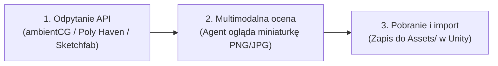

# Pobieranie i integracja assetów 3D oraz tekstur przez Agenta AI (Fetching 3rd-Party Assets)

Niniejszy dokument opisuje, jak umożliwić modelowi językowemu (LLM / agentowi AI) autonomiczne **wyszukiwanie, wizualne ocenianie (multimodal vision) oraz pobieranie modeli 3D i tekstur PBR** bezpośrednio do projektu Unity.

---

## 1. Trzy poziomy „widzenia” assetów przez Agenta AI



1. **Wyszukiwanie i filtrowanie (Metadata API):**
   Agent przeszukuje bazy po słowach kluczowych, filtrując wyniki według:
   - Licencji: **CC0 (Public Domain)** lub **CC-BY**.
   - Formatu: preferowany natywny format **glTF 2.0 / GLB** lub paczki tekstur PBR (PNG/JPG).
   - Złożoności geometrycznej: ograniczenie liczby trójkątów (np. `faceCount < 10000`).
2. **Wizualna ocena (Multimodal Vision):**
   Współczesne modele (Gemini, Claude) posiadają zmysł wzroku. Agent pobiera miniaturkę (*thumbnail*) proponowanego modelu lub materiału i analizuje obraz:
   - Czy deski drewniane pasują do XVIII-wiecznego pokładu jachtu?
   - Czy skała nie jest zbyt kanciasta lub fotorealistyczna względem stylu gry?
   - Dopiero po pozytywnej ocenie wizualnej model przechodzi do pobierania.
3. **Pobranie i automatyczny import:**
   Agent pobiera paczkę, rozpakowuje ją do odpowiedniego katalogu w `Assets/` i ewentualnie uruchamia skrypt Unity CLI rejestrujący asset.

---

## 2. Przegląd baz assetów z otwartym API

### A. ambientCG (Królowa darmowych materiałów PBR)
- **Katalog:** Ponad 2000 materiałów PBR (drewno, deski, piasek plażowy, skały, rdza, tkaniny żagli).
- **Licencja:** **CC0 (Public Domain)** – pełna swoboda komercyjna, brak wymogu atrybucji.
- **Dostęp API:** **Całkowicie darmowe REST API bez konieczności logowania czy podawania klucza API!**
- **Endpoint wyszukiwania:**
  ```text
  GET https://ambientcg.com/api/v2/full_json?q={search_query}&limit=5
  ```
- **Struktura pobierania:** Bezpośrednie linki do plików ZIP:
  ```text
  https://ambientcg.com/get?file={AssetId}_{Resolution}-PNG.zip
  # np. Ground037_2K-PNG.zip (zawiera Albedo, Normal, Roughness, AO, Displacement)
  ```

### B. Poly Haven (Materiały PBR, Rekwizyty 3D i mapy nieba HDR)
- **Katalog:** Wysokiej jakości assety skanowane (materiały podłoża, drewniane skrzynie, beczki, armaty, panoramy nieba HDR).
- **Licencja:** **CC0 (Public Domain)**.
- **Dostęp API:** W pełni otwarte, bezpłatne API bez tokenów.
- **Przykłady zapytań:**
  ```bash
  # Pobranie listy tekstur piasku:
  curl "https://api.polyhaven.com/assets?t=textures&c=sand"

  # Pobranie metadanych i linków do plików konkretnego assetu:
  curl "https://api.polyhaven.com/files/aerial_beach_01"
  ```

### C. Sketchfab Data API (Największa baza modeli 3D)
To główne źródło modeli w Lagoon (jacht *Amadis*, szalupa, pistolet skałkowy, tawerny Tortugi).
- **Katalog:** Miliony modeli 3D tworzonych przez społeczność.
- **Licencje:** Filtrowanie po modelach darmowych: `CC-BY` (wymagana atrybucja) oraz `CC0`.
- **Dostęp API:** Wymaga darmowego tokena API (dostępnego w ustawieniach profilu Sketchfab).
- **Zapytanie wyszukiwania:**
  ```bash
  curl -H "Authorization: Token TWÓJ_TOKEN_SKETCHFAB" \
    "https://api.sketchfab.com/v3/search?type=models&downloadable=true&license=by,cc0&q=pirate+cannon"
  ```
  Zwraca pole `download.gltf.url` z bezpośrednim linkiem do archiwum GLTF/GLB.

### D. Kenney.nl & Poly Pizza (Stylized / Low-Poly)
- **Kenney.nl:** Ponad 20 000 darmowych modeli low-poly w klimatach pirackich i morskich (*Pirate Kit*, *Nature Kit*), licencja CC0.
- **Poly Pizza (`https://poly.pizza`):** Archiwum modeli Google Poly na licencjach CC-BY/CC0.

---

## 3. Gotowy skrypt narzędziowy: `tools/asset_fetcher.py`

Aby agent AI mógł natychmiast wyszukiwać i pobierać tekstury i modele, umieszczamy w projekcie prosty skrypt w Pythonie:

```python
#!/usr/bin/env python3
"""
tools/asset_fetcher.py — Narzędzie dla agenta AI do pobierania tekstur PBR i modeli
Użycie:
  python tools/asset_fetcher.py search-texture "wood planks"
  python tools/asset_fetcher.py get-texture "Wood060" "2K" "Assets/Textures/Deck"
  python tools/asset_fetcher.py search-polyhaven "sand"
"""

import sys
import os
import io
import json
import zipfile
import urllib.request

def search_ambientcg(query, limit=4):
    url = f"https://ambientcg.com/api/v2/full_json?q={urllib.parse.quote(query)}&limit={limit}"
    req = urllib.request.Request(url, headers={'User-Agent': 'LagoonAssetFetcher/1.0'})
    with urllib.request.urlopen(req) as resp:
        data = json.loads(resp.read().decode())
    
    found = data.get("foundAssets", [])
    print(f"Znaleziono {len(found)} materiałów w ambientCG dla zapytania: '{query}':")
    for item in found:
        aid = item["assetId"]
        thumb = f"https://ambientcg.com/media/thumbs/600/{aid}.jpg"
        print(f"\n[ID]: {aid}")
        print(f"  Miniaturka: {thumb}")
        print(f"  Pobranie: python tools/asset_fetcher.py get-texture {aid} 2K Assets/Textures/{aid}")

def download_ambientcg_texture(asset_id, res="2K", out_dir=None):
    if not out_dir:
        out_dir = f"Assets/Textures/{asset_id}"
    os.makedirs(out_dir, exist_ok=True)
    
    zip_url = f"https://ambientcg.com/get?file={asset_id}_{res}-PNG.zip"
    print(f"==> Pobieranie {zip_url}...")
    
    req = urllib.request.Request(zip_url, headers={'User-Agent': 'LagoonAssetFetcher/1.0'})
    with urllib.request.urlopen(req) as resp:
        zip_bytes = resp.read()
    
    with zipfile.ZipFile(io.BytesIO(zip_bytes)) as z:
        z.extractall(out_dir)
        print(f"==> Rozpakowano pliki tekstur do katalogu: {out_dir}")
        for name in z.namelist():
            print(f"  - {name}")

def search_polyhaven(category="textures", query=""):
    url = f"https://api.polyhaven.com/assets?t={category}"
    req = urllib.request.Request(url, headers={'User-Agent': 'LagoonAssetFetcher/1.0'})
    with urllib.request.urlopen(req) as resp:
        data = json.loads(resp.read().decode())
    
    matches = [k for k, v in data.items() if query.lower() in k.lower() or query.lower() in " ".join(v.get("categories", []))]
    print(f"Znaleziono {len(matches)} assetów w Poly Haven dla zapytania: '{query}':")
    for k in matches[:5]:
        print(f"\n[ID]: {k} (Kategorie: {', '.join(data[k].get('categories', []))})")
        print(f"  Miniaturka: https://cdn.polyhaven.com/asset_img/primary/{k}.png?width=400")

if __name__ == "__main__":
    if len(sys.argv) < 2:
        print("Brak polecenia. Użyj: search-texture | get-texture | search-polyhaven")
        sys.exit(1)
        
    cmd = sys.argv[1]
    if cmd == "search-texture":
        search_ambientcg(sys.argv[2] if len(sys.argv) > 2 else "")
    elif cmd == "get-texture":
        aid = sys.argv[2]
        res = sys.argv[3] if len(sys.argv) > 3 else "2K"
        out = sys.argv[4] if len(sys.argv) > 4 else None
        download_ambientcg_texture(aid, res, out)
    elif cmd == "search-polyhaven":
        search_polyhaven("textures", sys.argv[2] if len(sys.argv) > 2 else "")
```

---

## 4. Przykładowy dialog i przebieg pracy z Agentem

1. **Użytkownik:**
   > *„Potrzebujemy ładnej tekstury desek na pokład jachtu. Znajdź coś z ciemnego drewna w 2K, sprawdź jak wygląda i pobierz do projektu.”*

2. **Agent AI:**
   - Wywołuje w terminalu:
     ```bash
     python tools/asset_fetcher.py search-texture "wood planks"
     ```
   - Pobiera miniaturkę `https://ambientcg.com/media/thumbs/600/Wood060.jpg` i otwiera ją w swoim podglądzie (`view_file`).
   - Ogląda obraz: *„Tekstura Wood060 ma wyraźne słoje, lekko postarzane wykończenie i idealnie pasuje do pokładu brygantyny.”*
   - Pobiera paczkę:
     ```bash
     python tools/asset_fetcher.py get-texture Wood060 2K Assets/Textures/BoatDeck
     ```
   - Unity natychmiast wykrywa pliki w folderze i tworzy materiał URP przypisany do masztów i pokładu jachtu.

---

## 5. Dedykowany serwer MCP dla assetów (`asset-store-mcp`)

Dla jeszcze głębszej integracji agent może korzystać z serwera **MCP**, który rejestruje funkcje bezpośrednio w interfejsie czatu.

### Przykładowa konfiguracja MCP (`~/.config/antigravity/mcp.json` lub Claude Desktop):
```json
{
  "mcpServers": {
    "asset-fetcher": {
      "command": "python",
      "args": ["/home/mike/Documents/GitHub/yacht/tools/mcp_asset_server.py"],
      "env": {
        "SKETCHFAB_API_KEY": "twoj_token_tutaj"
      }
    }
  }
}
```

Dzięki temu agent otrzymuje wbudowane narzędzia:
- `search_pbr_materials(query, resolution)`
- `inspect_asset_thumbnail(url)`
- `download_sketchfab_model(model_uid, output_path)`

---

## 6. Automatyczna atrybucja i zarządzanie licencjami

Przy pobieraniu modeli na licencji **CC-BY 4.0** (np. ze Sketchfaba), agent powinien automatycznie dopisywać metadane do pliku `CREDITS.md` w projekcie:

```markdown
### Nowo dodane assety:
- **Flintlock Pistol** — autor: *inciprocal*, licencja **CC-BY-4.0**, pobrano ze Sketchfab (UID: 80c06fd527ba43e38ffa899ab2a7d00b).
- **Wood060 (Deck)** — autor: *ambientCG*, licencja **CC0 (Public Domain)**.
```

Dzięki temu zachowujesz pełną przejrzystość prawną przed ewentualną komercjalizacją lub publikacją gry.
