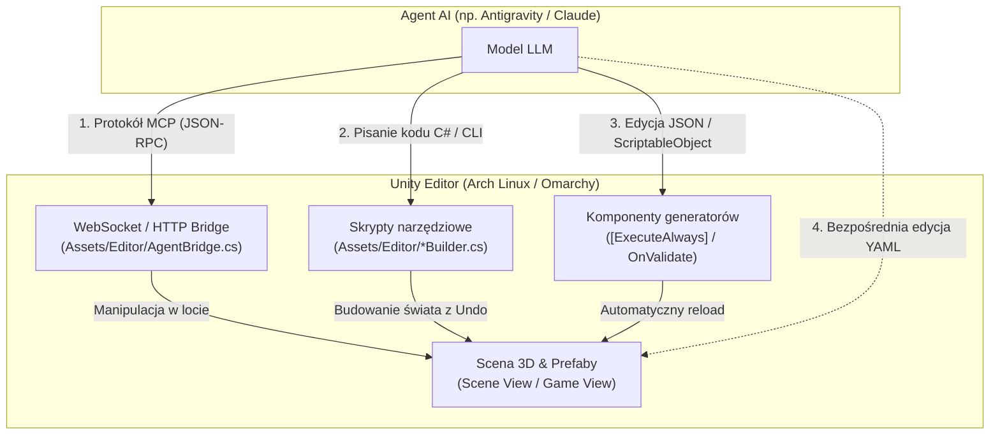

# Jak połączyć agenta AI (LLM) z Unity: MCP, automatyzacja i programowa edycja świata

Niniejszy przewodnik opisuje techniczne metody integracji modeli językowych (LLM / agentów AI, takich jak Antigravity, Claude, Cursor czy ChatGPT) ze środowiskiem **Unity 6**. Wyjaśnia, jak przejść z modelu czysto kodowego (znanego z Three.js, gdzie agent modyfikował pliki `.ts`) do potężnego workflow łączącego **generowanie kodu, protokół MCP (Model Context Protocol) i edycję sceny 3D w czasie rzeczywistym**.

---

## 1. Kontekst: Three.js vs Unity w pracy z LLM

| Aspekt | Three.js (dotychczas w `yacht`) | Unity (po migracji) |
| :--- | :--- | :--- |
| **Edycja świata** | Zmiana współrzędnych w kodzie (`WorldGen.ts`), kompilacja, odświeżenie przeglądarki. | Narzędzia wizualne WYSIWYG, zautomatyzowane skrypty edytora lub komendy przez most MCP. |
| **Pętla zwrotna** | Zgadywanie liczb w kodzie lub ręczne wpisywanie `?cam=x,y,z`. | Podgląd w Scene View w czasie rzeczywistym, inspekcja obiektów, zrzuty ekranu dla multimodalnego LLM. |
| **Rola agenta** | Wyłącznie pisanie kodu TypeScript. | Pisanie kodu C#, generowanie danych świata (JSON/ScriptableObject), wywoływanie narzędzi edytora przez MCP. |
| **Bezpieczeństwo** | Łatwo o błąd w składni psujący cały build. | Unity posiada wbudowany system cofania zmian (`Undo.RegisterCreatedObjectUndo`). |

---

## 2. Cztery metody sterowania Unity przez agenta AI



---

## Metoda 1: Most MCP (Model Context Protocol) w czasie rzeczywistym

Protokół **MCP (Model Context Protocol)** pozwala modelowi wywoływać dedykowane narzędzia (*tools*) działające wewnątrz uruchomionego edytora Unity.

### 1.1 Jak to działa architektonicznie?
1. W Unity w folderze `Assets/Editor/` działa lekki serwer WebSocket (lub HTTP) uruchamiany automatycznie przy otwarciu projektu.
2. Na maszynie działa serwer MCP (np. w Node.js/Pythonie), z którym komunikuje się Twój agent AI.
3. Serwer MCP tłumaczy polecenia agenta na zapytania JSON-RPC wysyłane do Unity przez WebSocket.
4. Skrypt w Unity odbiera polecenie w głównym wątku edytora (`EditorApplication.update`) i wykonuje operację na scenie.

### 1.2 Przykładowy zestaw narzędzi udostępnianych agentowi przez MCP:
- `unity_create_gameobject(name, primitive_type, position, rotation)` – tworzenie obiektów geometrycznych.
- `unity_instantiate_prefab(prefab_path, position, rotation, parent)` – rozstawianie gotowych modeli (np. palm, armat, budynków z Tortugi).
- `unity_set_transform(object_name_or_id, position, rotation, scale)` – przesuwanie i obracanie obiektów.
- `unity_set_property(object_name, component_name, property_name, value)` – zmiana parametrów (np. zmiana siły wiatru w komponencie `Wind`).
- `unity_get_scene_hierarchy()` – pobranie listy obiektów na scenie (agent widzi całe drzewo świata).
- `unity_take_screenshot()` – zrobienie zrzutu ekranu z kamery widoku sceny (multimodalny model może ocenić, czy wyspa wygląda naturalnie!).
- `unity_eval_csharp(code)` – wykonanie dowolnego jednoliniowego kodu C# w kontekście edytora.

### 1.3 Minimalna implementacja mostu C# w Unity (`Assets/Editor/AgentBridge.cs`):
```csharp
#if UNITY_EDITOR
using System;
using System.Net;
using System.Text;
using System.Threading;
using UnityEditor;
using UnityEngine;

[InitializeOnLoad]
public static class AgentBridge
{
    private static HttpListener listener;
    private static Thread listenerThread;
    private const int PORT = 8089;

    static AgentBridge()
    {
        StartServer();
        AssemblyReloadEvents.beforeAssemblyReload += StopServer;
        EditorApplication.quitting += StopServer;
    }

    private static void StartServer()
    {
        try
        {
            listener = new HttpListener();
            listener.Prefixes.Add($"http://127.0.0.1:{PORT}/");
            listener.Start();
            listenerThread = new Thread(ListenLoop) { IsBackground = true };
            listenerThread.Start();
            Debug.Log($"[AgentBridge] Most dla agenta AI aktywny na http://127.0.0.1:{PORT}/");
        }
        catch (Exception ex)
        {
            Debug.LogWarning($"[AgentBridge] Błąd startu mostu: {ex.Message}");
        }
    }

    private static void ListenLoop()
    {
        while (listener != null && listener.IsListening)
        {
            try
            {
                var context = listener.GetContext();
                ThreadPool.QueueUserWorkItem((_) => ProcessRequest(context));
            }
            catch { }
        }
    }

    private static void ProcessRequest(HttpListenerContext context)
    {
        var req = context.Request;
        string responseString = "{}";

        if (req.HttpMethod == "POST" && req.Url.AbsolutePath == "/execute")
        {
            using var reader = new System.IO.StreamReader(req.InputStream, req.ContentEncoding);
            string body = reader.ReadToEnd();

            // Kolejkujemy wykonanie w wątku głównym Unity
            EditorApplication.delayCall += () =>
            {
                // Tutaj parsujemy JSON i manipulujemy obiektami na scenie
                Debug.Log($"[AgentBridge] Otrzymano polecenie od agenta: {body}");
            };

            responseString = "{\"status\":\"ok\"}";
        }

        byte[] buffer = Encoding.UTF8.GetBytes(responseString);
        context.Response.ContentType = "application/json";
        context.Response.ContentLength64 = buffer.Length;
        context.Response.OutputStream.Write(buffer, 0, buffer.Length);
        context.Response.OutputStream.Close();
    }

    private static void StopServer()
    {
        if (listener != null)
        {
            listener.Stop();
            listener.Close();
            listener = null;
        }
    }
}
#endif
```

---

## Metoda 2: Unity Editor CLI i Unity Hub CLI (Bezinwazyjne sterowanie z konsoli)

Sam edytor Unity posiada **pełny interfejs wiersza poleceń (CLI)**. Pozwala on agentowi AI na wykonywanie kompilacji, testów, generowania świata i budowania gry w trybie bezgłowym (**headless**), podczas gdy Ty możesz mieć w tym samym czasie otwarty edytor w Hyprlandzie.

### 2.1 Kluczowe flagi `unity-editor` (lub ścieżki z Unity Hub)

| Flaga | Działanie | Zastosowanie dla Agenta AI |
| :--- | :--- | :--- |
| `-batchmode` | Uruchamia Unity bez interfejsu graficznego. | Agent wykonuje zadania w tle bez wyskakiwania okien. |
| `-nographics` | Nie inicjalizuje podsystemu graficznego/GPU. | Przyspiesza uruchomienie do ułamka sekundy (testy, kompilacja, bake danych). |
| `-projectPath <ścieżka>` | Wskazuje ścieżkę do projektu Unity. | Zapewnia uruchomienie w odpowiednim katalogu. |
| `-executeMethod Klasa.Metoda` | Uruchamia statyczną metodę C# z atrybutem edytora. | Automatyczne generowanie świata, optymalizacja assetów. |
| `-logFile -` | Przekierowuje wszystkie logi do standardowego wyjścia (`stdout`). | **Kluczowe:** Agent w terminalu od razu widzi błędy, ostrzeżenia i logi. |
| `-quit` | Zamyka proces edytora natychmiast po wykonaniu metody. | Zapobiega wiszeniu procesu w pamięci. |
| `-runTests` | Uruchamia testy jednostkowe (Unity Test Framework). | Automatyczne testowanie fizyki jachtu po zmianach w kodzie. |
| `-buildLinux64Player <ścieżka>` | Buduje samodzielny plik wykonywalny gry pod Linuksa. | Automatyczne tworzenie grywalnych buildów. |

---

### 2.2 Przykłady komend CLI dla agenta AI:

#### A. Weryfikacja kompilacji C# (odpowiednik `tsc` w Three.js):
Gdy agent zmodyfikuje skrypty C#, może natychmiast sprawdzić w konsoli, czy projekt kompiluje się bez błędów:
```bash
unity-editor -batchmode -nographics -projectPath . -quit -logFile -
```
Jeśli w kodzie pojawi się błąd (np. brak średnika lub zła nazwa typu), Unity wypisze błąd w `stdout` z dokładnym numerem pliku i linii.

#### B. Uruchomienie metody generowania świata:
Agent pisze skrypt `Assets/Editor/TortugaBuilder.cs` i wywołuje go z terminala:
```bash
unity-editor -batchmode -nographics -projectPath . -executeMethod TortugaBuilder.BuildDocks -quit -logFile -
```

#### C. Uruchomienie testów fizyki (zastępuje dawne `npx tsx tools/sim.ts`):
```bash
unity-editor -batchmode -nographics -projectPath . -runTests -testPlatform EditMode -testResults results.xml -logFile -
```

#### D. Kompilacja gry do pliku wykonywalnego (Standalone Build):
```bash
unity-editor -batchmode -projectPath . -buildLinux64Player ./build/lagoon.x86_64 -quit -logFile -
```

---

### 2.3 Unity Hub CLI (`unityhub --headless`)

Sam Unity Hub również posiada interfejs konsolowy, pozwalający agentowi na weryfikację środowiska lub doinstalowanie modułów:
```bash
# Sprawdzenie zainstalowanych wersji Unity
unityhub --headless editors --installed

# Pobranie nowej wersji silnika
unityhub --headless install --version 6000.0.x --changeset <hash>

# Doinstalowanie wsparcia dla Linuksa (IL2CPP)
unityhub --headless install-modules --version 6000.0.x -m linux-il2cpp
```

---

### 2.4 Praktyczny skrypt pomocniczy: `tools/unity.sh`

Aby ani Ty, ani agent nie musieli wpisywać długich poleceń z flagami, warto dodać do projektu prosty skrypt wrapperowy `tools/unity.sh`:

```bash
#!/usr/bin/env bash
set -e

UNITY_BIN="${UNITY_BIN:-unity-editor}"
PROJECT_DIR="$(cd "$(dirname "${BASH_SOURCE[0]}")/.." && pwd)"

case "$1" in
  check)
    echo "==> Sprawdzanie kompilacji C#..."
    "$UNITY_BIN" -batchmode -nographics -projectPath "$PROJECT_DIR" -quit -logFile -
    ;;
  test)
    echo "==> Uruchamianie testów EditMode..."
    "$UNITY_BIN" -batchmode -nographics -projectPath "$PROJECT_DIR" -runTests -testPlatform EditMode -testResults "$PROJECT_DIR/test-results.xml" -logFile -
    ;;
  build)
    echo "==> Budowanie gry Linux Standalone..."
    mkdir -p "$PROJECT_DIR/build"
    "$UNITY_BIN" -batchmode -projectPath "$PROJECT_DIR" -buildLinux64Player "$PROJECT_DIR/build/lagoon.x86_64" -quit -logFile -
    ;;
  exec)
    shift
    echo "==> Wykonywanie metody $1..."
    "$UNITY_BIN" -batchmode -nographics -projectPath "$PROJECT_DIR" -executeMethod "$1" -quit -logFile -
    ;;
  *)
    echo "Użycie: $0 {check|test|build|exec NazwaKlasy.Metoda}"
    exit 1
    ;;
esac
```

Po nadaniu uprawnień (`chmod +x tools/unity.sh`), agent może wywołać po prostu:
```bash
./tools/unity.sh check
```

---

### 2.5 Kompletny łańcuch narzędziowy CLI: Blender + Unity

Dzięki narzędziom konsolowym powstaje w pełni zautomatyzowany łańcuch produkcyjny (*pipeline*) sterowany przez agenta:

```text
1. Przygotowanie modelu 3D (Blender CLI):
   blender -b lodz.blend -P tools/prepare_hull_collision.py

2. Import i rejestracja w Unity (Unity CLI):
   ./tools/unity.sh exec AssetProcessor.ReimportBoats

3. Weryfikacja symulacji fizyki:
   ./tools/unity.sh test

4. Ocena wizualna:
   Ty otwierasz okno Unity i testujesz jacht na wodzie!
```


---

## Metoda 3: Podejście Data-Driven / Code-First (Zalecane dla `yacht`)

To bezpośrednia, ulepszona ewolucja tego, jak gra była zorganizowana w Three.js w plikach [`WorldGen.ts`](file:///home/mike/Documents/GitHub/yacht/src/world/WorldGen.ts) i [`TortugaTown.ts`](file:///home/mike/Documents/GitHub/yacht/src/world/TortugaTown.ts).

### 3.1 Jak to działa?
1. Układ świata jest zdefiniowany w czystym pliku danych (np. `TortugaLayout.json` lub klasie C# ze stałymi).
2. Na scenie znajduje się obiekt z komponentem `TownGenerator`, który posiada metodę z atrybutem `[ExecuteAlways]` lub `OnValidate()`.
3. **Workflow z agentem:**
   - Zlecasz agentowi: *„Przebuduj rynek w Tortudze – przesuń tawernę o 15 metrów na wschód i dodaj 3 kramy targowe”*.
   - Agent edytuje wyłącznie plik konfiguracyjny (kod C# lub JSON).
   - **Unity natychmiast wykrywa zmianę pliku na dysku i w ułamku sekundy przebudowuje obiekty 3D na scenie w oknie Scene View!**

### Przykład implementacji generatora:
```csharp
using UnityEngine;

[ExecuteAlways]
public class TownGenerator : MonoBehaviour
{
    [System.Serializable]
    public struct BuildingEntry
    {
        public string prefabName;
        public Vector3 position;
        public float rotationY;
    }

    [SerializeField] private BuildingEntry[] buildings;

    private void OnValidate()
    {
        // Wywoływane automatycznie za każdym razem, gdy dane w skrypcie/Inspektorze ulegną zmianie
        RebuildTown();
    }

    [ContextMenu("Przebuduj miasteczko")]
    public void RebuildTown()
    {
        // Czyścimy poprzednie obiekty potomne
        while (transform.childCount > 0)
        {
            DestroyImmediate(transform.GetChild(0).gameObject);
        }

        if (buildings == null) return;

        foreach (var entry in buildings)
        {
            GameObject prefab = Resources.Load<GameObject>($"Town/{entry.prefabName}");
            if (prefab != null)
            {
                GameObject obj = Instantiate(prefab, transform);
                obj.transform.localPosition = entry.position;
                obj.transform.localRotation = Quaternion.Euler(0, entry.rotationY, 0);
            }
        }
    }
}
```

---

## Metoda 4: Bezpośrednia edycja plików Scen i Prefabów (YAML)

Wszystkie pliki `.unity` (sceny), `.prefab` oraz `.mat` (materiały) w Unity to format tekstowy **YAML**.

### Kiedy warto z tego korzystać z agentem:
- **Tworzenie i modyfikacja materiałów (`.mat`):** Agent może wygenerować nowy materiał z określonym kolorem, teksturą i gładkością bez otwierania edytora.
- **Drobne zmiany w prefabach (`.prefab`):** Zmiana wartości pojedynczego parametru liczbowego w komponencie.
- **Konfiguracja `ScriptableObject` (`.asset`):** Doskonały format dla baz danych przedmiotów, parametrów żagli czy właściwości wiatru – czytelny dla LLM i natywnie wspierany przez Unity.

*Uwaga:* Nie zaleca się zlecania agentowi pisania od zera dużych plików `.unity`, ponieważ zawierają one unikalne identyfikatory GUID i FileID powiązane z metadanymi projektu (`.meta`).

---

## 3. Rekomendowany workflow codziennej pracy ("Podział Ról")

W pracy z agentem nad grą Lagoon w Unity rekomendowany jest następujący podział obowiązków:

1. **Rola Agenta AI (LLM):**
   - **Logika i matematyka:** Pisanie i optymalizacja skryptów fizyki (`BoatDynamics.cs`), aerodynamiki żagli z Burst (`SailDeformerJob.cs`), algorytmów wysokości terenu (`WorldGenMath.cs`).
   - **Narzędzia edytora:** Tworzenie generatorów procedur i narzędzi wspomagających w `Assets/Editor/`.
   - **Konfiguracja:** Uzupełnianie danych o budynkach, przedmiotach, ożaglowaniu w plikach JSON / ScriptableObject.
   - **Shadery:** Pisanie i optymalizacja kodu HLSL dla niestandardowych efektów wody i zniekształceń lunety.

2. **Twoja rola (Człowiek w Edytorze 3D):**
   - **Ocena wizualna i estetyka:** Sprawdzasz w Scene View, czy proporcje wysp, oświetlenie i kadry wyglądają klimatycznie.
   - **Precyzyjny micro-tuning:** Przesuwasz skrzynię na pokładzie lub kamerę o 20 cm za pomocą gizma myszką (trudno opisać takie niuanse promptem tekstowym, a myszką robi się to w 2 sekundy).
   - **Natychmiastowy Playtest:** Wciskasz `Play`, chwytasz za stery i sprawdzasz odczucia z żeglugi.
