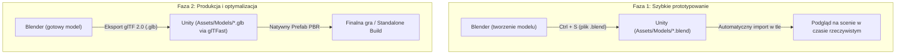

# Modelowanie obiektów 3D w Blenderze pod Unity: Workflow, Formaty i Dobre Praktyki

Niniejszy poradnik opisuje standardy tworzenia nowych modeli 3D w programie **Blender** na potrzeby projektu Lagoon w **Unity 6 (URP)**. Zawiera wskazówki dotyczące formatów plików, konfiguracji materiałów PBR, punktów obrotu oraz optymalizacji pod kątem wydajności na laptopie Framework 13.

---

## 1. Dwa główne podejścia do współpracy Blender ↔ Unity



### Sposób 1: Zapis pliku `.blend` bezpośrednio w projekcie (Live Prototyping)
Dzięki instalacji Blendera w systemie (`pacman -S blender`), Unity posiada wbudowany most konwersji:
1. Zapisujesz plik roboczy prosto w katalogu projektu, np. `Assets/Models/Prototypy/nowa_tawerna.blend`.
2. Unity w tle bezgłowo wywołuje Blendera i automatycznie generuje prefab.
3. Za każdym razem, gdy w Blenderze przesuniesz wierzchołki i wciśniesz **`Ctrl + S`**, model w oknie edytora Unity zaktualizuje się w ułamku sekundy.

> **Wskazówka:** To idealny workflow podczas fazy poszukiwania kształtu, testowania skali czy dopasowywania geometrii do otoczenia.

---

### Sposób 2: Eksport do formatu `.glb` (Rekomendowany standard produkcyjny)
Gdy model jest ukończony, wyeksportuj go jako samodzielny plik binarnego glTF:
W menu Blendera: **File → Export → glTF 2.0 (.glb)**

#### Zalecane ustawienia eksportera Blendera:
- **Format:** `glTF Binary (.glb)` (wszystkie siatki i tekstury spakowane w pojedynczym pliku).
- **Panel Include:**
  - Zaznacz `Selected Objects` (eksportuje tylko zaznaczony model, pomijając domyślne światła i kamerę Blendera).
- **Panel Transform:**
  - Zaznacz `+Y Up` (automatycznie kompensuje różnicę osi między Blenderem Z-up a Unity Y-up).
- **Panel Geometry:**
  - Zaznacz `Apply Modifiers` (automatycznie zatwierdza modyfikatory np. *Mirror*, *Subdivision*, *Bevel* czy *Decimate* bez niszczenia pliku źródłowego).
  - Zaznacz `UVs`, `Normals` oraz `Tangents` (niezbędne do poprawnego działania map normalnych w URP).
- **Panel Materials:**
  - Ustawienie `Export Materials` (standardowy materiał Blendera mapuje się 1:1 na materiał URP Lit).

---

## 2. Cztery złote zasady modelowania pod Lagoon / Unity

### Zasada 1: Skala 1:1 (System metryczny)
- **1 jednostka w Blenderze = dokładnie 1 metr w Unity.**
- Modele powinny odpowiadać rzeczywistym wymiarom historycznym:
  - Marynarz: wysokość ~1.75–1.80 m.
  - Chata rybacka na Tortudze: wysokość ściany ~2.8 m, kalenica dachu ~4.5 m.
  - Szalupa (*jollyboat*): długość ~5.5 m.
  - Brygantyna (*Amadis*): długość kadłuba ~28 m.
- **Kluczowy skrót przed każdym eksportem:**
  W trybie *Object Mode* zaznacz model i wciśnij:
  $$\mathbf{Ctrl + A} \longrightarrow \mathbf{Apply\ All\ Transforms}\quad (\text{Scale \& Rotation})$$
  Niezastosowanie skali powoduje błędy w oświetleniu, nienaturalne działanie fizyki kolizji i zniekształcenia tekstur.

---

### Zasada 2: Punkt obrotu (Origin / Pivot)
Punkt obrotu determinuje, jak obiekt jest transformowany i osadzany w świecie Unity:

| Typ obiektu | Gdzie ustawić Origin w Blenderze? | Uzasadnienie |
| :--- | :--- | :--- |
| **Budynki, chaty, molo** | **Na dole modelu na poziomie gruntu ($Z = 0$)**, w centrum rzutu | Po przeciągnięciu obiektu z prefabu na teren w Unity, budynek staje idealnie na ziemi, zamiast zapaść się w piasek. |
| **Palmy, krzewy, skały** | **Na spłaszczonej podstawie pnia / spodu skały** | Umożliwia precyzyjne pędzlowanie roślinności po analitycznym terenie `WorldGen`. |
| **Części ruchome (ster, koło sterowe, bom)** | **Dokładnie w osi obrotu/zawiasu** | W Blenderze: zaznacz krawędź zawiasu $\rightarrow$ `Shift + S` (*Cursor to Selected*) $\rightarrow$ `Set Origin to 3D Cursor`. |
| **Kadłub statku** | **Na środku linii wodnej (konstrukcyjnej)** | Ułatwia obliczenia wyporności i hydrostatyki w skrypcie `BoatDynamics.cs`. |

---

### Zasada 3: Materiały PBR z nodem Principled BSDF
Aby model z Blendera zaimportował się do Unity z gotowym, realistycznym materiałem **URP Lit**:

1. Używaj wyłącznie standardowego noda **Principled BSDF** w oknie *Shader Editor*.
2. Podpinaj mapy tekstur według standardu:
   - **Base Color** $\rightarrow$ Tekstura koloru (Albedo / Diffuse).
   - **Roughness** $\rightarrow$ Mapa szorstkości (wartości od 0.0 = lustrzany połysk lakieru do 1.0 = matowe stare drewno).
   - **Metallic** $\rightarrow$ Wartość 0.0 dla drewna, żagli i lin; 1.0 dla okuć żelaznych, spiżowych armat i mosiężnych okuć koła sterowego.
   - **Normal** $\rightarrow$ Podpinana wyłącznie przez nod pomocniczy **Normal Map** do wejścia *Normal* w Principled BSDF.
3. Eksporter `.glb` automatycznie spakuje te kanały do standardu PBR Metallic-Roughness, który Unity odczytuje bezbłędnie.

---

### Zasada 4: Geometria kolizyjna (Colliders)
Szczegółowa siatka wizualna (np. budynek z 8000 wielokątów z deskami i dachówkami) **nie powinna być używana do kalkulacji fizyki**. Obciąża to niepotrzebnie procesor i może blokować marynarza w drobnych detalach.

#### Wzorzec optymalnej kolizji:
1. W pliku Blendera stwórz obok prostą siatkę z kilku prostopadłościanów (np. 12 wielokątów dla ścian i 8 dla dachu).
2. Nazwij obiekt kolizyjny z przyrostkiem `_Collider` (np. `Tavern_Collider`).
3. W Unity na obiekcie `Tavern_Collider`:
   - Usuń komponent `MeshRenderer` (obiekt staje się niewidzialny).
   - Dodaj komponent `MeshCollider` (z zaznaczoną opcją *Convex* jeśli ma brać udział w dynamice).
4. Dla prostych skrzyń i beczek w Unity używaj zawsze natywnych prymitywów: **Box Collider** lub **Capsule Collider** (są setki razy szybsze obliczeniowo niż siatki wielokątów).

---

## 3. Podział części ruchomych jachtu (Architektura modelu statku)

Nawiązując do struktury kodu żagli i łodzi z Three.js ([Boat.ts](file:///home/mike/Documents/GitHub/yacht/src/boat/Boat.ts) i [Sails.ts](file:///home/mike/Documents/GitHub/yacht/src/boat/Sails.ts)), przy modelowaniu nowych jednostek w Blenderze należy podzielić statek na **niezależne obiekty potomne (Hierarchy)**:

```text
Statek_Root (Pivot na linii wodnej, środek ciężkości)
│
├── Kadlub_Visual (kadłub, pokład, wanty stałe, kabestany)
├── Kadlub_Collider (uproszczona bryła z kilkoma wypornościowymi sekcjami)
├── Pletwa_Sterowa (Pivot na osi zawiasu steru na rufie)
├── Kolo_Sterowe (Pivot w osi obrotu koła na mostku)
├── Maszt_Fok (jeśli obracany)
├── Reja_Dolna (Pivot w punkcie mocowania do masztu na wysokości Y)
├── Reja_Gorna (Pivot w osi obrotu)
├── Bom_Grot (Pivot przy pięcie bomu na maszcie)
└── Gafel (Pivot przy maszcie)
```

Dzięki takiemu rozdzieleniu obiektów w Blenderze, skrypt `BoatDynamics.cs` w Unity może bezpośrednio obracać kątem rei czy steru za pomocą jednej linijki:
```csharp
rudderTransform.localRotation = Quaternion.Euler(0, rudderAngleDegrees, 0);
```

---

## 4. Automatyzacja przygotowania modeli przez Blender CLI dla Agenta

Jeśli pobierzesz surowy model ze Sketchfab lub z bazy assetów, możesz zlecić agentowi AI jego automatyczne przygotowanie skryptem Pythona:

```bash
blender -b surowy_model.fbx -P tools/blender_clean_asset.py -- wyjscie.glb
```

Skrypt ten może w kilka sekund w trybie bezgłowym:
1. Usunąć kamery i światła.
2. Zastosować wszystkie transformacje (`Apply Scale/Rotation`).
3. Wycentrować punkt obrotu na spodzie geometrii.
4. Wygenerować uproszczoną siatkę kolizyjną modyfikatorem *Convex Hull*.
5. Zapisać gotowy plik `.glb` prosto do folderu `Assets/Models/` w Unity.
