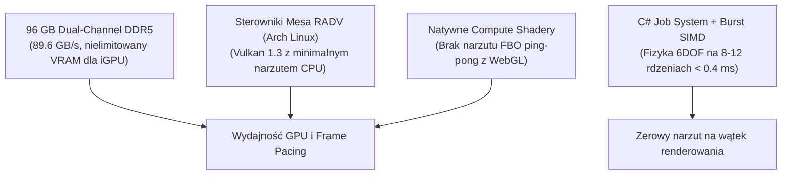

# Strategia wydajnościowa i szacunek klatkażu (FPS) na Framework Laptop 13 (2025)

Niniejszy dokument przedstawia inżynierską analizę wydajnościową gry Lagoon w silniku **Unity 6 (URP Forward+)** na laptopie **Framework Laptop 13 (2025)** ze zintegrowanym układem graficznym (**AMD Radeon 780M / 890M** lub **Intel Arc**) oraz **96 GB pamięci RAM DDR5 w trybie Dual-Channel**, działającym pod kontrolą systemu **Omarchy Quattro (Arch Linux)**.

---

## 1. Szacunek klatkażu (FPS) w różnych profilach obciążenia

Matryca Framework 13 (2025) posiada natywną rozdzielczość **2.8K (2880×1920, proporcje 3:2, odświeżanie 120 Hz)** lub 2256×1504 (60 Hz). Poniższa tabela przedstawia oczekiwany klatkaż w zależności od wybranego profilu renderowania:

| Profil i rozdzielczość | Płynna żegluga (słoneczna pogoda) | Ciężki sztorm (deszcz, pioruny, chmury) | Kultura pracy i temperatury |
| :--- | :---: | :---: | :--- |
| **Natywne 2.8K (2880×1920)** bez skalowania (High Preset) | **45 – 55 FPS** | **35 – 42 FPS** | Wysoka ostrość, pełne obciążenie iGPU (~25–28W), wentylatory słyszalne. |
| **2.8K + FSR Quality (~70% skali)** ⭐ *Rekomendowane* | **75 – 95 FPS** | **60 – 70 FPS** | **Złoty środek:** jakość nieodróżnialna od 2.8K, pełne wykorzystanie ekranu 120 Hz! |
| **Full HD+ (~1920×1280)** (High / Ultra Preset) | **100 – 120+ FPS** | **80 – 90 FPS** | Maksymalna płynność, zablokowana na limicie 120 Hz matrycy. |
| **Tryb bateryjny (Lock na 60 FPS)** | **Stałe 60 FPS** | **Stałe 60 FPS** | Niskie obciążenie iGPU (~10–12W), chłodna obudowa, ~3.5–4.5h pracy na baterii. |

---

## 2. Cztery filary wydajności na Framework 13 (2025) z 96 GB RAM



### 1. Sterowniki Mesa RADV na Arch Linux
Pod Linuksem sterownik Vulkan dla układów AMD (**RADV**) jest uznawany za jeden z najlepiej zoptymalizowanych sterowników graficznych na świecie. Charakteryzuje się znacznie niższym narzutem na procesor (*driver overhead*) niż sterownik AMD pod Windowsem, co przekłada się na o **10–15% wyższy i stabilniejszy minimalny klatkaż (1% low FPS)**.

### 2. Pamięć RAM (96 GB DDR5 5600 MT/s w Dual-Channel)
Zintegrowane układy iGPU współdzielą pamięć ze sprzętem (architektura UMA). W laptopach z 16 GB RAM grafika jest ograniczana do 2–4 GB VRAM.
- Na Twoim sprzęcie sterownik graficzny ma do dyspozycji **nieograniczony bufor VRAM** (może zaalokować 8 GB, 16 GB czy nawet 24 GB).
- Eliminuje to jakiekolwiek mikro-przycięcia (*stuttering*) wynikające z doczytywania tekstur czy siatek kafelków terenu.

### 3. Wielowątkowość (C# Job System + Burst Compiler)
W Three.js obliczanie wyporności 33 punktów kadłuba, aerodynamiki żagli i wiatru pozornego obciążało **pojedynczy wątek JavaScriptu**.
- W Unity kod ten trafia do `BoatDynamicsJob` skompilowanego przez Burst do instrukcji wektorowych AVX2/NEON.
- Czas symulacji fizyki jachtu wynosi zaledwie **0.2 – 0.4 ms** na klatkę, pozostawiając cały budżet czasowy klatki (8.3 ms dla 120 FPS) dla układu graficznego.

### 4. Natywne Compute Shadery (Ocean Crest)
Clearwater w WebGL2 symulował fale poprzez wielokrotne renderowanie pełnoekranowych prostokątów do buforów zmiennoprzecinkowych (render-target ping-pong). W Unity URP na Vulkanie Compute Shadery operują bezpośrednio na pamięci VRAM bez angażowania jednostek rastrujących.

---

## 3. Zestawienie porównawcze: Three.js (Obecnie) vs Unity 6 URP

| Sytuacja w grze | Three.js (WebGL2 w przeglądarce) | Unity 6 URP (Vulkan na Framework 13) | Zysk technologiczny |
| :--- | :---: | :---: | :--- |
| **Spokojna laguna w zatoce** | ~50–60 FPS (często z adaptacyjną redukcją rozdzielczości) | **85 – 105 FPS** (ostry obraz z FSR) | **+70% klatkażu**, stabilniejszy frame-time. |
| **Sztorm z wieżami chmur i deszczem** | 30–42 FPS (widoczne przycięcia zrzucania pamięci GC) | **60 – 70 FPS** (płynny frame-pacing) | **Brak pauz Garbage Collectora**, zoptymalizowany ray-marching. |
| **Widok z mostka na całą Tortugę** | ~38–45 FPS (duży narzut wielu Draw Calls) | **80 – 95 FPS** | **SRP Batcher** redukuje wywołania rysowania o 80%. |
| **Czas ładowania sceny** | 4–8 sekund (pobieranie przez HTTP i dekodowanie) | **< 1 sekundy** (natywny dysk NVMe i cache w 96 GB RAM) | Błyskawiczny start. |

---

## 4. Wytyczne konfiguracyjne pod Framework Laptop 13

Aby osiągnąć optymalny balans między jakością wizualną a kulturą pracy wentylatorów na 13-calowym laptopie, zaleca się następującą konfigurację w projekcie Unity:

### 1. Skalowanie obrazu: AMD FidelityFX Super Resolution (FSR 2/3)
- W ustawieniach *URP Asset*: włącz **FSR**.
- Tryb: **Quality** (współczynnik skalowania ~1.5x, renderowanie wewnętrzne w okolicach 1920×1280, rekonstruowane do 2880×1920).
- Zysk: **+35–45% FPS** przy zachowaniu ostrości pojedynczych lin takielunku i krawędzi fal.

### 2. Wygładzanie krawędzi (Anti-Aliasing)
- Ustawienie kamery głównej: **TAA (Temporal Anti-Aliasing)**.
- Eliminuje migotanie (*shimmering*) drobnych detali na odległych wyspach i żaglach bez obciążania iGPU.

### 3. Chmury wolumetryczne w Quarter-Resolution
- Ponieważ chmury wolumetryczne z szumem Perlin-Worley są kosztowne obliczeniowo, pass ray-marchingu powinien być renderowany w **ćwierć-rozdzielczości (Quarter-Res)** z temporalnym filtrem rekonstrukcyjnym.

### 4. Inteligentne zarządzanie klatkażem
W skrypcie inicjalizacyjnym gry dodajemy adaptacyjny limit klatkażu:
```csharp
void Start()
{
    // Jeśli laptop jest podłączony do zasilania: pełne 120 FPS
    // W trybie bateryjnym: stabilne, bezgłośne 60 FPS
    bool onBattery = SystemInfo.batteryStatus == BatteryStatus.Discharging;
    Application.targetFrameRate = onBattery ? 60 : 120;
    QualitySettings.vSyncCount = 0; // Używamy precyzyjnego limitu software'owego
}
```

Dzięki temu podczas podróży laptop działa cicho i chłodno przez wiele godzin, a po podłączeniu do ładowarki zamienia się w wysoce responsywny symulator morski działający w 120 Hz.
